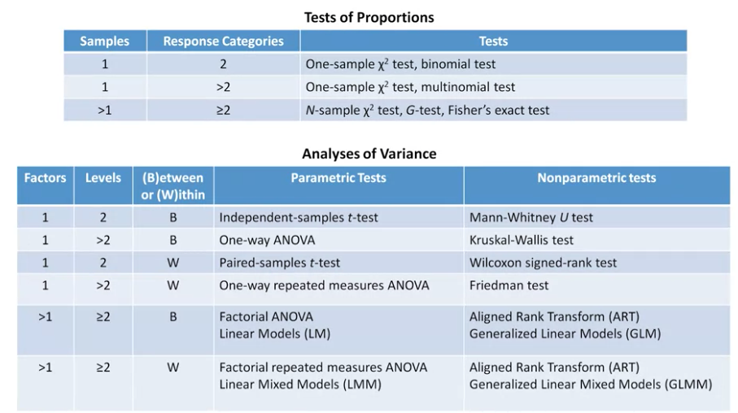

```{r}
# my favourite libraries
library(ggplot2)
library(tidyr)
library(dplyr)

```
Date: 10 Feb 2021

Notes from the Coursera Course: *Designing, Running and Analyzing Experiments* By *Jacob Wobbrock*



# Week 1
A/B TESTING or Website A vs B
How many participants do we need? Is 60 enough? more is better?

If the thing you are comparing are very different then you need fewer subjects if the things you are comparing are similar then you may need more subjects. 

In every experiment, there are 4 things to consider:
1. Participants
2. Apparatus
3. Experiment procedure
4. Design and analysis

#### 1. Participants
Who are they and where did they come from? 
Probability and non-probability sampling

Some examples of non probability sampling are purposive sampling, convenience sampling, and snowball sampling.

Exclusion criteria vs inclusion criteria

#### 2. Apparatus
How do we capture the data?

#### 3. Experiment procedure
Do they perform tasks, what kinds, and how many?  How long do they take?

#### 4. Design and analysis
This is design in the sense of experiment design. What's the formal design that we are using? How is it characterized, and then what does that mean for the analysis that we use?


# Week 2
Description of a Study of User Preferences

So let's assume for our study of 60 participants and their preferences between two websites, that they were all stakeholders in the design of the site. And we've excluded people familiar with the old site. So they're either going to get version A or B, perhaps we're delivering it to a client of our design firm. So they haven't seen either versions, so they're going in to each fresh. And we'll find out that preference in the end.

They give us a preference at the end of their time. Let's say, we give them 20 minutes on each site. Let's make it open and not task-driven. They can just explore and use the site, and give us their preference. 

The statistical and experimental question is, based on the preferences we gather, is there a significant difference in the preference for one site or the other?

## One-sample tests of proportions
We have a sample of their preference, whether they like A or B
```{r}

# read in a data file with 2 response categories
prefsAB = read.csv("data/prefsAB.csv")
View(prefsAB)

#    Subject Pref
# 1        1    B
# 2        2    B
# 3        3    B
# 4        4    B
# 5        5    B
# 6        6    B
```

```{r}

prefsAB$Subject = factor(prefsAB$Subject) # convert to nominal factor
prefsAB$Pref = factor(prefsAB$Pref) # Rv4
summary(prefsAB)
# Pref  
# A:14  
# B:46  
    
plot(prefsAB$Pref)


prefsAB %>% 
count(Pref) %>% 
ggplot(aes(Pref, n)) + 
    geom_col(aes(fill = Pref))
```

Add a new chunk by clicking the *Insert Chunk* button on the toolbar or by pressing *Cmd+Option+I*.

When you save the notebook, an HTML file containing the code and output will be saved alongside it (click the *Preview* button or press *Cmd+Shift+K* to preview the HTML file). 

The preview shows you a rendered HTML copy of the contents of the editor. Consequently, unlike *Knit*, *Preview* does not run any R code chunks. Instead, the output of the chunk when it was last run in the editor is displayed.

